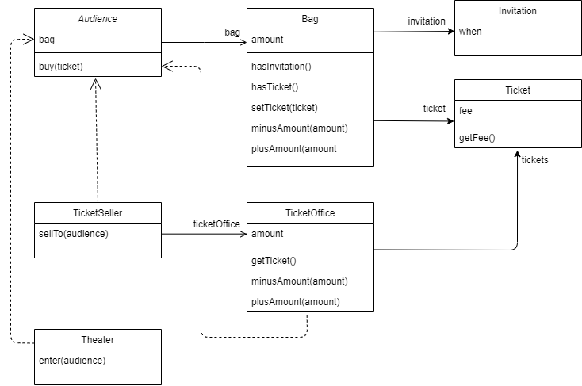

# 오브젝트
소스코드: https://github.com/seovalue/java-study/tree/main/src/object

## [Chapter01](https://github.com/seovalue/java-study/tree/main/src/book/chapter01)
### step01
**예상을 빗나가는 코드**  
`Theater` 클래스의 `enter` 메서드가 수행하는 일을 말로 풀어보자.  
> 소극장은 관람객의 가방을 열어 그 안에 초대장이 들어있는지 살펴본다. 가방 안에 초대장이 있다면 판매원은
>매표소에 보관돼 있는 티켓을 관람객의 가방 안으로 옮긴다. 가방 안에 초대장이 들어 있지 않다면 관람객의 가방에서
>티켓 금액만큼의 현금을 꺼내 매표소에 적립한 후 매표소에 보관돼 있는 티켓을 관람객의 가방 안으로 옮긴다.  

문제 1. 관람객과 판매원이 소극장의 통제를 받는 수동적인 존재이다.  
문제 2. 코드를 이해하기 위해서는 여러 가지 세부적인 내용들을 한꺼번에 기억하고 있어야 한다.  
문제 3. `Audience`와 `TicketSeller`를 변경할 경우 `Theater`도 변경해야한다.

> 결합도가 높고 의존성이 높다.

  

### step02
* 해결 방법  
- `Audience`와 `TicketSeller`가 직접 `Bag`와 `TicketOffice`를 처리하는 자율적인 존재가 되도록 설계를 변경한다.  
1. `Theater`의 `enter` 메서드에서 `TicketOffice`에 접근하는 모든 코드를 `TicketSeller` 내부로 숨긴다.
2. `TicketSeller`에서 `getTicketOffice` 메서드를 제거한다. `ticketOffice`의 가시성이 private이고 접근 가능한 퍼블릭 메서드가 더 이상 존재하지 않기 때문에 
외부에서는 `ticketOffice`에 직접 접근할 수 없다. 결과적으로 `ticketOffice`는 `ticketSeller`만이 접근할 수 있다.  >> **캡슐화**  
3. `TicketSeller` 에서 `Audience`의 `Bag`에 접근하는 메서드를 변경한다. `Audience`에서 직접 `Bag`을 관리하도록 한다.  
4. `Bag`을 자율적인 존재로 바꾼다. 위와 동일한 과정을 통해 캡슐화한다.

> 데이터와 프로세스가 동일한 모듈 내부에 위치하도록 프로그래밍. OOP

  

## [Chapter02](https://github.com/seovalue/java-study/tree/main/src/book/chapter02)
### 영화예매시스템 만들기
1. 요구사항 살펴보기  
- 상영과 영화의 구분: 영화는 영화에 대한 기본 정보 즉, 제목, 상영시간, 가격 정보와 같이 영화가 가지고 있는 기본적인 정보를 가리킬 때 사용한다.
 상영은 실제로 관객들이 영화를 관람하는 사건을 표현한다. 상영일자, 시간, 순번 등을 가리키기 위해 상영을 사용한다.  
- 특정한 조건을 만족하는 예매자는 요금을 할인받을 수 있다: `할인 조건`과 `할인 정책`을 만족해야한다.  
    할인 조건: 가격의 할인 여부를 결정하며 `순서 조건`과 `기간 조건`의 두 종류로 나눈다. 순서 조건은 상영 순번을 이용해 할인 여부를 결정하는 규칙이다. 
    기간 조건은 영화 상영 시작 시간을 이용해 할인 여부를 결정한다. 영화 시작 시간이 해당 기간 안에 포함될 경우 요금을 할인한다.  
    할인 정책: 할인 정책에는 `금액 할인 정책`과 `비율 할인 정책`이 있다. 금액 할인 정책은 예매 요금에서 일정 금액을 할인해주는 방식이며 비율 할인 정책은 
    정가에서 일정 비율의 요금을 할인해 주는 방식이다.  
    
2. 객체지향 프로그래밍을 향해  
첫째, 어떤 클래스가 필요한지를 고민하기 전에 어떤 객체들이 필요한지 고민하라. 클래스는 공통적인 상태와 행동을 공유하는 객체들을 추상화한 것이다. 따라서 클래스의 
윤곽을 잡기 위해서는 어떤 객체들이 어떤 상태와 행동을 가지는지를 먼저 결정해야 한다. 
> 객체를 중심에 두는 접근 방법은 설계를 단순하고 깔끔하게 만든다.
  
둘째, 객체를 독립적인 존재가 아니라 기능을 구현하기 위해 협력하는 공동체의 일원으로 봐야한다. 객체는 다른 객체에게 도움을 주거나 의존하면서 살아가는 협력적인 존재다. 객체를 
협력하는 공동체의 일원으로 바라보는 것은 설계를 유연하고 확장 가능하게 만든다. 
> 훌륭한 협력이 훌륭한 객체를 낳고 훌륭한 객체가 훌륭한 클래스를 낳는다.  
  
3. 도메인의 구조를 따르는 프로그램 구조
소프트웨어는 사용자가 원하는 어떤 문제를 해결하기 위해 만들어진다. 영화 예매 시스템의 목적은 영화를 좀 더 쉽고 빠르게 예매하려는 사용자의 문제를 해결하는 것이다. 이처럼 문제를 해결하기 위해 사용자가 프로그램을 사용하는 분야를 
`도메인`이라 부른다.
  
일반적으로 클래스의 이름은 대응되는 도메인 개념의 이름과 동일하거나 적어도 유사하게 지어야한다. 따라서 다음과 같이 클래스를 명명한다.  
```
영화 - Movie
상영 - Screening
할인 정책 - DiscountPolicy
금액 할인 정책 - AmountDiscountPolicy
비율 할인 정책 - PercentDiscountPolicy
할인 조건 - DiscountCondition
순번 조건 - SequenceCondition
기간 조건 - PeriodCondition
예매 - Reservation
```  

4. 자율적인 객체  
객체는 상태와 행동을 함께 가지는 복합적인 존재이다. 또한, 스스로 판단하고 행동하는 자율적인 존재이다. 객체지향은 객체라는 단위 안에 
데이터와 기능을 한 덩어리로 묶음으로써 문제 영역의 아이디어를 적절히 표현할 수 있게 했다. 이처럼 데이터와 기능을 객체 내부로 함께 묶는 것을 
캡슐화라고 부른다. 캡슐화와 접근 제어는 객체를 두 부분으로 나눈다. 하나는 외부에서 접근 가능한 부분으로 이를 퍼블릭 인터페이스라고 부른다. 
다른 하나는 외부에서는 접근 불가능하고 오직 내부에서만 접근 가능한 부분으로 이를 구현이라고 부른다. 인터페이스와 구현의 분리 원칙은 핵심 원칙이다.
 일반적으로 객체의 상태는 숨기고 행동만 외부에 공개해야한다.  
 


